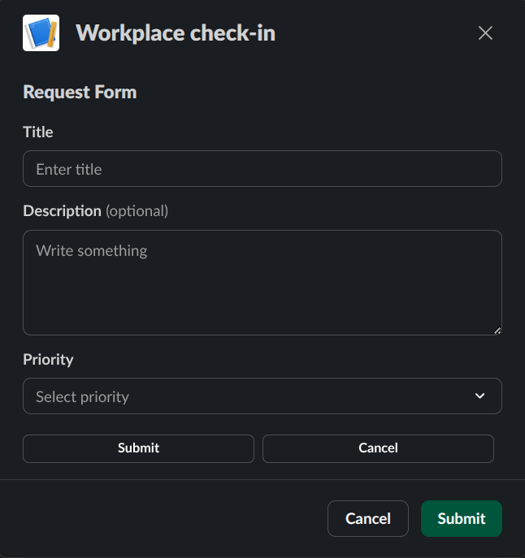

# Interactive Form Example

Simple example of creating a form with input validation.

```csharp
var blocks = BlockBuilder.Create()
    .AddHeader("Request Form")
    .AddInput<PlainTextInput>("Title", input => input
        .ActionId("title_input")
        .Placeholder("Enter title"))
    .AddInput<PlainTextInput>("Description", input => input
        .ActionId("description_input")
        .Multiline()
        .Optional())
    .AddInput<StaticSelectMenu>("Priority", input => input
        .ActionId("priority_select")
        .Placeholder("Select priority")
        .AddOption("Low", "low")
        .AddOption("Medium", "medium")
        .AddOption("High", "high"))
    .AddActions(actions => actions
        .AddButton("submit", "Submit")
        .AddButton("cancel", "Cancel"))
    .Build();
```



## Handling Form Submission

```csharp
public async Task HandleFormSubmission(InteractionPayload payload)
{
   var fields = payload.State.Values.SelectMany(b => b.Value);
   var title = fields.First(kv => kv.Key == "title_input").Value.Value;
   var description = fields.First(kv => kv.Key == "description_input").Value.Value;
   var priority = fields.First(kv => kv.Key == "priority_select").Value.SelectedOption.Value;
    
   // Process form data...
}
```
